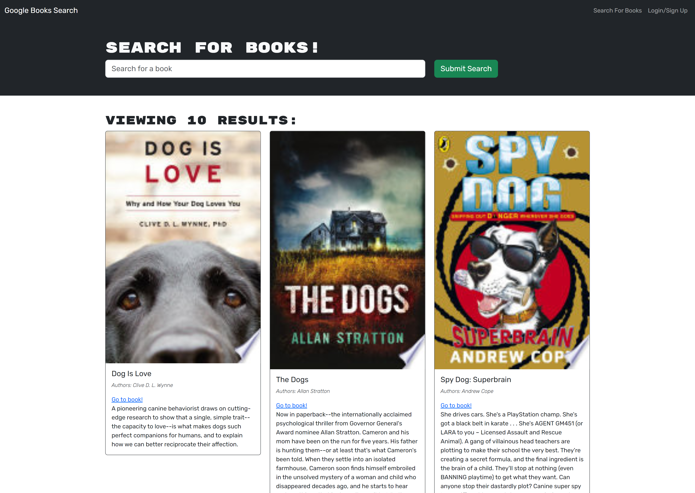
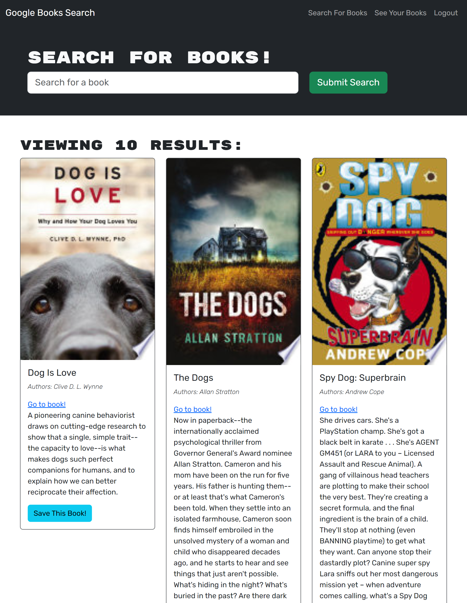
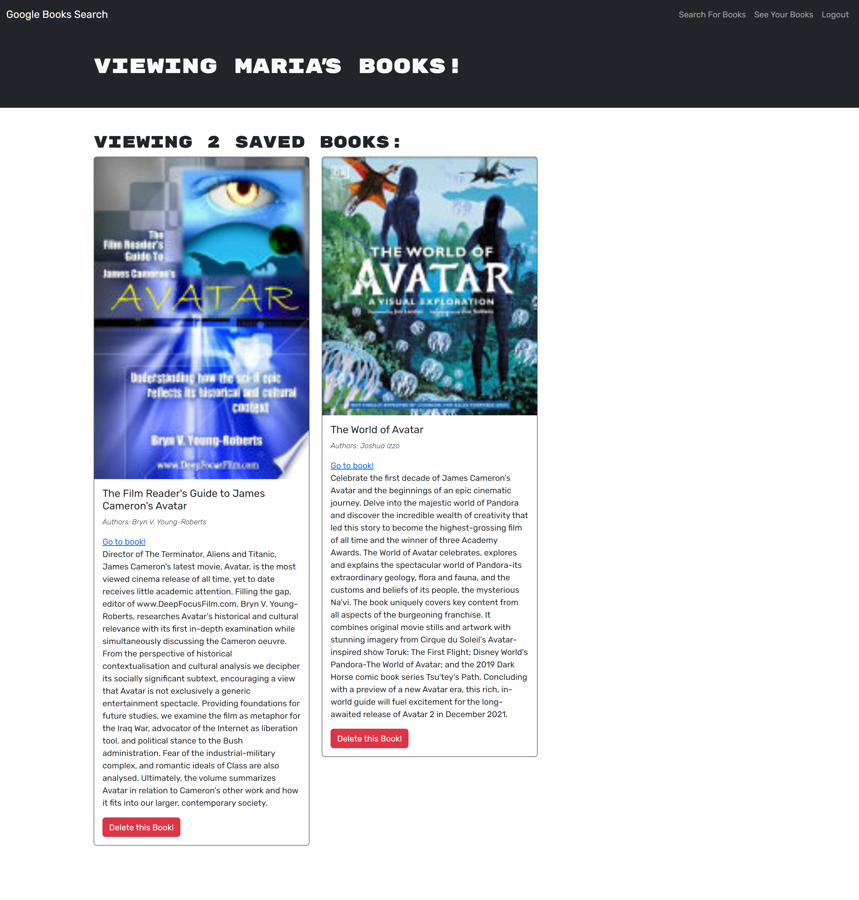

# Book Search Engine

The book Search Engine is a full-stack web application that allows users to search for books using the Google Books API. Users can create an account, and when logged in, they have the additional functionality of saving books to their personal reading list.

## Table of Contents

- [Installation](#installation)
- [Usage](#usage)
- [License](#license)
- [Screensho and URL of the deployed application](#screenshot-and-url-of-the-deployed-application)

## Installation

To install the necessary dependencies, run the following command:

```
npm install
```

```
npm run develop
```

## Usage

The application is deployed on Heroku at the following link: https://sheltered-refuge-33863-0e2c85f30aa4.herokuapp.com/

## License

This project is licensed under the MIT license.

## Screenshot and URL of the deployed application





[Link deployed application](https://sheltered-refuge-33863-0e2c85f30aa4.herokuapp.com/)
